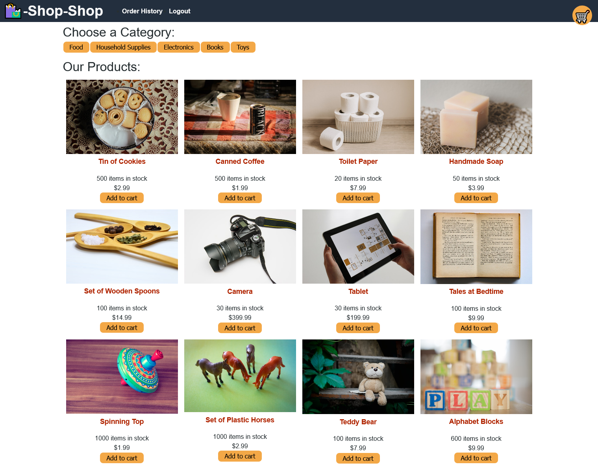

# shop-shop

## Description
An e-commerce site built on the MERN stack, using GraphQL to manage queries, Redux to manage global state, and Stripe to manage payment.

* [Deployed Site](https://pure-savannah-05101.herokuapp.com/).
* [Github Source Repository](https://github.com/byampols/shop-shop).

## Table of Contents
1. [Usage](#usage)
2. [Testing](#testing)
3. [License](#license)
4. [Contributors](#contributors)
5. [Questions](#questions)

## Usage

* Press Login/Signup to Login or Sign Up by entering your email and a password (and your name if you're signing up)
* Search for items and add them to your cart (which can be toggled in the top right corner)
* Press each category to only see items in the chosen category
* Clicking on an item will bring you to a more descriptive page
* You can add items to your cart while not logged in (or offline) and they will be saved.
* If you are logged in, you can purchase items from your cart using Stripe (*note that Stripe is set up to use test keys here, so there is no real items to purchase, please do not use real credit card information if you want to test this -- see below)
* If you are logged in, you can also view your order history
* Press Logout to log out.

## Testing

If you want to test the stripe payment and order history, create a cart and attempt to begin a transaction; this will take you to a stripe page. Enter bogus info into the fields except for credit card number, which should be "4242 4242 4242 4242". This will create a test transaction and show up in your order history.

## License

[MIT License](https://opensource.org/licenses/MIT).

## Contributors
* [Ben Yampolsky](github.com/byampols)
* [Express](https://expressjs.com/)
* [MongoDB](https://www.mongodb.com/)
* [Mongoose](https://mongoosejs.com/docs/)
* [React](https://reactjs.org/)
* [ApolloServer](https://www.apollographql.com/)
* [jwt](https://jwt.io/)
* [bcrypt](https://www.npmjs.com/package/bcrypt)
* [graphql](https://graphql.org/)
* [Redux](https://redux.js.org/)
* [Stripe](https://stripe.com/)

## Questions
### [My github profile.](https://github.com/byampols)
### [Email me if you have any questions!](byampols@alumni.cmu.edu)